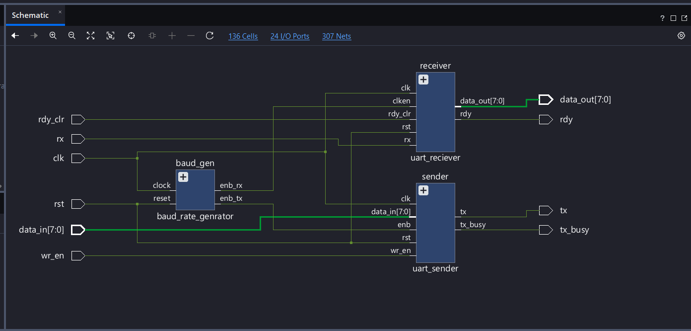
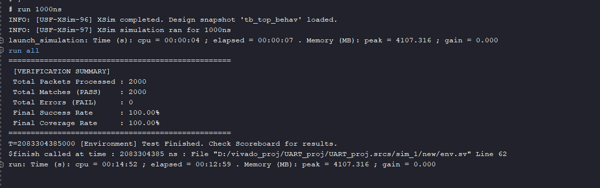
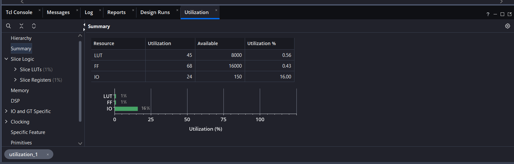
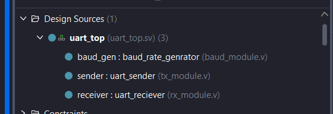

# Full-Duplex UART Controller & SystemVerilog OOP Verification

## Project Overview
In this project, I designed and synthesized a full-duplex UART (Universal Asynchronous Receiver-Transmitter) controller from scratch. To ensure the hardware logic is mathematically sound before physical implementation, I built a custom Object-Oriented SystemVerilog testbench. 

This repository contains both the RTL hardware design (mapped to a Xilinx Artix-7 FPGA) and the verification environment used to stress-test it.

## Hardware Architecture (RTL)
The physical hardware is completely isolated from the software testbench. I structured the design using a top-level wrapper (`uart_top.sv`) to instantiate and wire the internal sub-modules together. 

*   **Baud Rate Generator:** Divides the 100MHz system clock to generate precise timing pulses (`enb_tx` and `enb_rx`).
*   **UART Sender:** A state machine that serializes 8-bit parallel data and transmits it via the `tx` pin.
*   **UART Receiver:** A state machine that samples the `rx` pin and reconstructs the serial bitstream back into 8-bit parallel data.

Because the sender and receiver are independent hardware blocks utilizing separate `tx` and `rx` pins, the system operates in true full-duplex mode.

## Verification Methodology (UVM Basics)
To verify the design, I implemented a layered Object-Oriented testbench in SystemVerilog. While written in raw SV, the architecture strictly follows the foundational principles of the **Universal Verification Methodology (UVM)**. 

I separated the testbench into specific classes, passing data through Mailboxes and a virtual interface (`vif`), mimicking a professional UVM verification hierarchy:

*   **Transaction (`uart_item.sv`):** The base object holding the randomized data payload. (Equivalent to a UVM Sequence Item).
*   **Generator (`generator.sv`):** Randomizes 2000 unique data packets and sends them to the driver via a mailbox. (Equivalent to a UVM Sequencer).
*   **Driver (`driver.sv`):** Receives the virtual packets and physically toggles the `wr_en` and `data_in` pins on the DUT interface to inject the data.
*   **Monitor (`monitor.sv`):** Passively observes the `rdy` and `data_out` pins, capturing the processed data and sending it to the scoreboard.
*   **Scoreboard (`scoreboard.sv`):** The self-checking mechanism. It compares the expected data from the generator against the actual data captured by the monitor to determine pass/fail criteria.
*   **Environment (`env.sv`):** The container that instantiates, connects, and starts all the above components.

By physically looping the `tx` output back into the `rx` input in `tb_top.sv`, I verified the full-duplex functionality. The design successfully routed 2,000 randomized packets with 0 dropped payloads, achieving a 100% functional coverage rate.

## Synthesis & Resource Utilization
After verifying the logic, I ran the synthesis toolchain in Vivado to map the SystemVerilog RTL to physical silicon. 

**Target Device:** Xilinx Artix-7 (xc7a12ticsg325-1L)

By keeping the verification software strictly isolated from the synthesizable hardware, the compiler successfully optimized the design into a highly efficient footprint:
*   **Slice LUTs:** 45 (0.56% utilization)
*   **Slice Registers (Flip-Flops):** 68 (0.43% utilization)

## Repository Structure
The project is strictly categorized to separate physical design from virtual testing tools.

*   `/rtl`: Contains the synthesizable hardware files (`uart_top.sv`, sender, receiver, baud generator).
*   `/tb`: Contains the SystemVerilog UVM-style verification classes and the physical testbench wrapper (`tb_top.sv`).
*   `/images`: Contains project diagrams and utilization metrics.

---
**Author:** Aaradhya Kaushal
